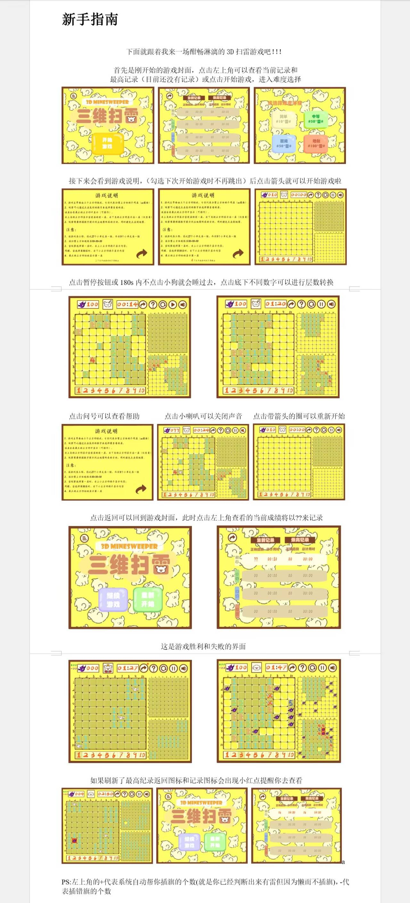

# Mine3D

Mine3D 是一个使用 C++ 编写的 Windows 桌面 3D 扫雷游戏。

项目使用 MinGW-w64 编译，EasyX 绘制界面，WinMM 播放音效。

## 新手指南



## 游戏简介

这是一个基于三维空间的扫雷项目，雷区规模为 `10 x 10 x 10`。玩家需要在不同层之间切换，结合数字提示判断雷的位置，并尽量在更短时间内完成排雷。

## 功能

- 三维雷区，不局限于传统二维扫雷
- 4 个难度等级：10、30、50、100 颗雷
- 支持通过底部层数栏切换当前显示层
- 带有音效、暂停、帮助、重新开始和成绩界面
- `GameRecord.txt` 会在运行时自动创建，用于保存本地成绩

## 环境要求

- Windows
- MinGW-w64，并确保 `g++.exe` 在 `PATH` 中
- PowerShell，用于首次构建时自动下载 EasyX for MinGW
- 网络连接，用于首次下载 EasyX 依赖

> `build.bat` 会自动下载 MinGW 版 EasyX 到项目本地 `.deps/` 目录，不会修改系统里的 MinGW 安装目录。

## 快速开始

在仓库根目录执行：

```bat
build.bat
```

构建成功后运行：

```powershell
.\Mine3D.exe
```

运行时请在仓库根目录启动程序，这样 `Sweep_IMG/` 和 `Sweep_MP3/` 中的资源才能按相对路径加载。点击窗口右上角关闭按钮会退出游戏进程。

如果从 GitHub Release 下载，请先解压整个压缩包，再在解压后的目录中运行 `Mine3D.exe`。不要单独移动 `Mine3D.exe`，否则资源文件无法按相对路径加载。

第一次构建时，脚本会自动下载：

```text
https://easyx.cn/download/easyx4mingw_25.9.10.zip
```

下载后的文件会放在：

```text
.deps/easyx4mingw_25.9.10/
```

该目录已被 `.gitignore` 忽略，不需要提交到仓库。

## VS Code 使用

仓库包含 `.vscode/tasks.json` 和 `.vscode/launch.json`：

- `Ctrl + Shift + B`：运行 `build.bat` 构建项目
- `F5`：先构建，再使用 `gdb` 启动调试

如果 VS Code 找不到 `gdb.exe`，请确认 MinGW 的 `bin` 目录已经加入 `PATH`。也可以把 `.vscode/launch.json` 中的 `miDebuggerPath` 改成完整路径，例如：

```json
"miDebuggerPath": "D:\\Program Files\\mingw64\\bin\\gdb.exe"
```

## 构建脚本说明

`build.bat` 会自动完成以下工作：

- 检查 `g++.exe` 是否可用
- 根据 MinGW 架构选择 EasyX 的 `lib32` 或 `lib64`
- 首次构建时自动下载并解压 EasyX for MinGW
- 如果旧的 `Mine3D.exe` 进程仍在后台运行，自动关闭后再重新构建
- 生成 `Mine3D.exe`

如果不想使用自动下载的 EasyX，也可以手动指定 `EASYX_DIR`：

```bat
set EASYX_DIR=D:\path\to\easyx4mingw_25.9.10
build.bat
```

目录结构需要包含：

```text
easyx4mingw_25.9.10/
  include/graphics.h
  lib64/libeasyx.a
```

32 位 MinGW 则使用 `lib32/libeasyx.a`。

## 操作说明

- 左键：打开一个格子
- 双击已打开的数字格：当周围旗子数量与数字相等时，自动打开周围格子
- 右键：首步之后插旗或取消插旗
- 点击底部层数栏：切换当前显示层
- 点击右上角图标：帮助、重新开始、暂停、声音、返回主界面

## 项目结构

- `Main Func.cpp`：程序入口
- `Game_Mine.cpp` / `Game_Mine.h`：游戏状态初始化和主循环
- `algorithm functions.cpp` / `algorithm_function.h`：游戏逻辑、输入处理、成绩记录
- `draw functions.cpp` / `draw_function.h`：界面绘制和资源加载
- `mingw_compat.cpp`：兼容新版 MinGW 链接 EasyX 预编译库
- `Sweep_IMG/`：运行时图片资源
- `Sweep_MP3/`：运行时音频资源
- `build.bat`：Windows 本地构建脚本
- `release.bat`：生成 GitHub Release 使用的 zip 包
- `publish_release.bat`：调用 GitHub CLI 发布 Release

## 仓库说明

- 不要提交生成的 `Mine3D.exe`、目标文件、调试文件
- 不要提交 `.deps/`，这是本地依赖缓存目录
- 不要提交 `GameRecord.txt`，这是运行时生成的本地成绩文件
- 如果要分享可执行程序，建议把 `Mine3D-windows-x64.zip` 作为 GitHub Release 附件上传，压缩包内应包含 `Mine3D.exe`、`Sweep_IMG/` 和 `Sweep_MP3/`
